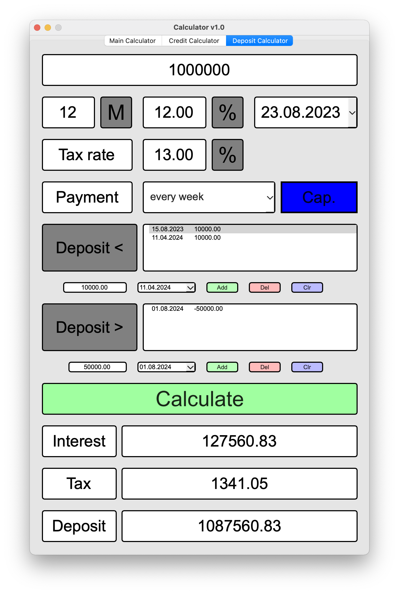

# Calculator

## Intro
    Этот проект представляет расширенную версию стандартного калькулятора.
    Проект выполнен на С++ с использованием фреймворка Qt.
    При реализации использован архитектурный паттерн MVC.git branch 

## Features
- ввод произвольного математического выражения с клавиатуры
- построение графика функции, заданной с помощью выражения с переменной x
- расчет по кредиту
- расчет по вкладу
    
## Figures

### Отрисовка функции y = sqrt(cos(x))*cos(200*x)+sqrt(x^2)-3.1415/4*(4-x^2)^0.01

### Отрисовка функции y = sqrt(sin(x)^2)+5*2.71^(-(x^100))*cos(x)

### Расчет аннуитетных выплат по кредиту

### Расчет дифференцированных выплат по кредиту

### Расчет по вкладу без капитализации

### Расчет по вкладу с капитализацией

## Notes
- Результаты расчетов по кредитам и вкладам сравнивались с аналогичными на сайте *calcus.ru*